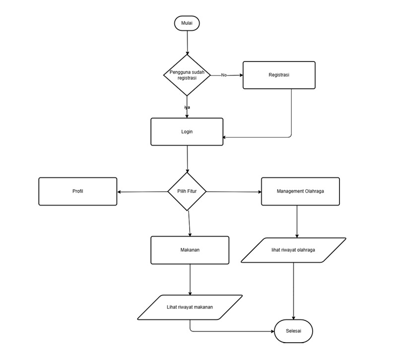
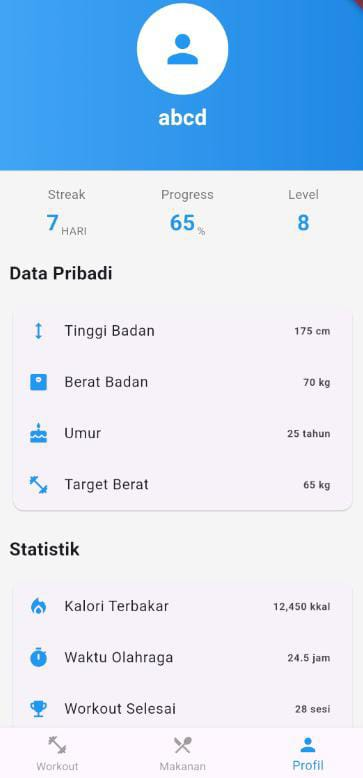
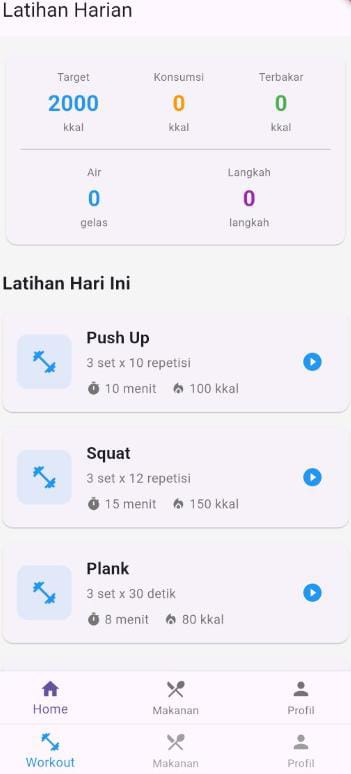

 # ANALISIS   
# Kesehatan dan Kebugaran
## Pendahuluan
    Di dunia yang semakin sibuk dan penuh dengan tuntutan, banyak individu yang 
kesulitan untuk menjaga gaya hidup sehat dan kebugaran. Faktor-faktor seperti pekerjaan yang 
padat, kurangnya waktu, dan ketidaktahuan tentang pola makan yang sehat sering kali 
menghalangi seseorang untuk mencapai tujuan kesehatan mereka. Tidak hanya itu, dengan 
begitu banyaknya informasi yang beredar mengenai diet, latihan, dan kebiasaan sehat, banyak 
orang merasa bingung dalam memilih langkah terbaik untuk tubuh mereka. Oleh karena itu, 
sebuah solusi yang sederhana, efektif, dan mudah diakses sangat dibutuhkan untuk membantu 
orang-orang meraih kesehatan optimal. Aplikasi Kesehatan dan Kebugaran ini dirancang untuk 
mengatasi masalah-masalah tersebut dengan menawarkan platform terintegrasi yang dapat 
diakses oleh siapa saja yang ingin memperbaiki kebiasaan hidup mereka. Aplikasi ini bertujuan 
untuk memberikan kontrol lebih bagi penggunanya dalam mengelola kesehatan pribadi mereka 
melalui fitur-fitur yang didasarkan pada data pribadi dan kebutuhan individu. Dengan 
menggabungkan pelacakan kalori makanan, program latihan yang disesuaikan, dan analisis 
kemajuan kebugaran, aplikasi ini menjadi pendamping yang ideal dalam perjalanan kesehatan 
dan kebugaran. Saat ini, banyak aplikasi kesehatan di luar sana yang menawarkan pelacakan 
kalori atau saran latihan, tetapi sering kali mereka terpisah atau tidak dapat disesuaikan dengan 
kebutuhan pengguna secara individu. Beberapa aplikasi hanya fokus pada satu aspek, seperti 
diet atau latihan fisik, sementara pengguna membutuhkan solusi yang mengintegrasikan 
berbagai elemen tersebut dalam satu platform. Aplikasi ini bertujuan untuk mengatasi gap 
tersebut dengan menawarkan pengalaman yang holistik, di mana setiap pengguna dapat 
mengakses informasi tentang pola makan mereka, merancang rutinitas latihan, serta melacak 
kemajuan mereka dalam satu aplikasi yang mudah digunakan.

## Tujuan Project
Tujuan dari proyek aplikasi ini adalah untuk menyediakan platform yang mudah diakses bagi pengguna dalam memonitor dan mengelola aspek kesehatan mereka, baik dalam hal konsumsi makanan maupun rutinitas olahraga, yang bertujuan meningkatkan kebugaran tubuh secara keseluruhan.

## Lingkup Project
Aplikasi **Kesehatan dan Kebugaran** ini akan mencakup fitur-fitur utama berikut:
- **Pendaftaran Pengguna**: Pengguna dapat mendaftar untuk membuat akun.
- **Login Pengguna**: Pengguna dapat login menggunakan username dan password untuk mengakses aplikasi.
- **Pelacakan Makanan**: Pengguna dapat menginput makanan yang dikonsumsi dan melacak kalori yang terkandung dalam makanan tersebut.
- **Manajemen Olahraga**: Pengguna dapat mengelola kegiatan olahraga mereka, mencatat jenis olahraga, durasi, dan intensitasnya.
- **Riwayat Aktivitas**: Pengguna dapat melihat riwayat makanan yang telah dikonsumsi dan olahraga yang telah dilakukan.

## Fungsionalitas
### 1 Pendaftaran Pengguna
- Pengguna baru dapat mendaftar dengan memasukkan data pribadi seperti nama, email, dan password.
- Aplikasi harus memastikan bahwa semua detail yang dimasukkan valid sebelum pengguna dapat melanjutkan.

### 2 Login Pengguna
- Pengguna yang sudah terdaftar dapat login menggunakan username dan password.
- Aplikasi harus memverifikasi kredensial pengguna untuk memastikan login berhasil.

### 3 Pelacakan Makanan
- Pengguna dapat memasukkan jenis makanan yang telah dikonsumsi.
- Aplikasi akan menyediakan informasi kalori dari makanan yang dicatat oleh pengguna.
- Pengguna dapat melihat riwayat makanan yang telah mereka konsumsi.

### 4 Manajemen Olahraga
- Pengguna dapat mencatat jenis olahraga yang dilakukan, durasi, dan tingkat intensitasnya.
- Aplikasi harus memungkinkan pengguna untuk mengelola jadwal olahraga mereka.
- Pengguna dapat melihat riwayat olahraga yang telah dilakukan.

## Non-Fungsional
1. **Keamanan**: Data pengguna harus disimpan dengan aman dan dilindungi dari akses yang tidak sah.
2. **Antarmuka Pengguna**: Aplikasi harus memiliki antarmuka pengguna yang intuitif dan mudah digunakan.
3. **Kinerja**: Aplikasi harus mampu menangani banyak pengguna secara bersamaan tanpa penurunan kinerja yang signifikan.

## Alur Proses Pengguna
1. **Pendaftaran**: Pengguna memasukkan detail pendaftaran dan akun dibuat.
2. **Login**: Pengguna login untuk mengakses aplikasi dengan memasukkan username dan password.
3. **Penggunaan Fitur**: Pengguna dapat mencatat konsumsi makanan, mencatat aktivitas olahraga, dan memantau riwayat kesehatan.
4. **Logout**: Pengguna dapat keluar dari aplikasi setelah selesai menggunakan fitur.

## Flowchart

## Tampilan App

   
   
   